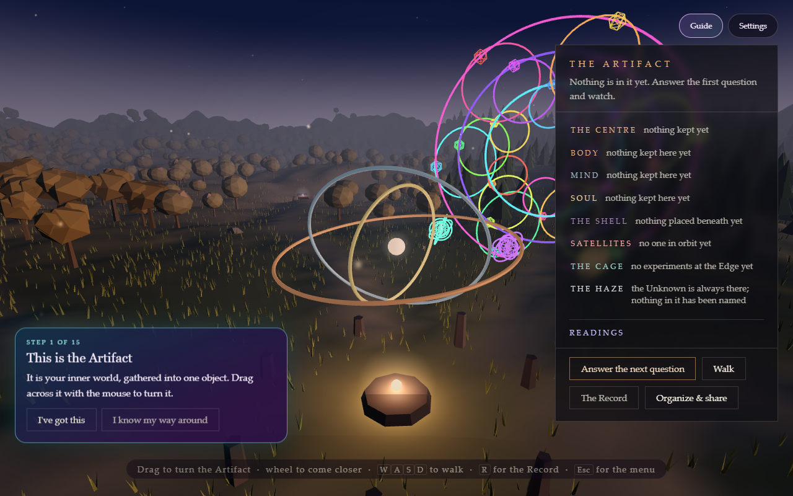
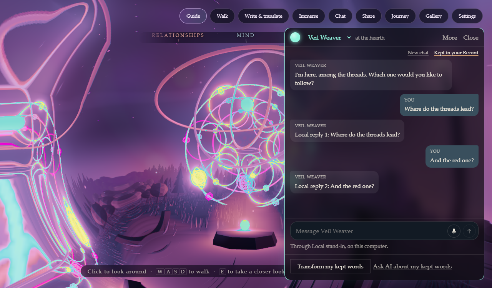
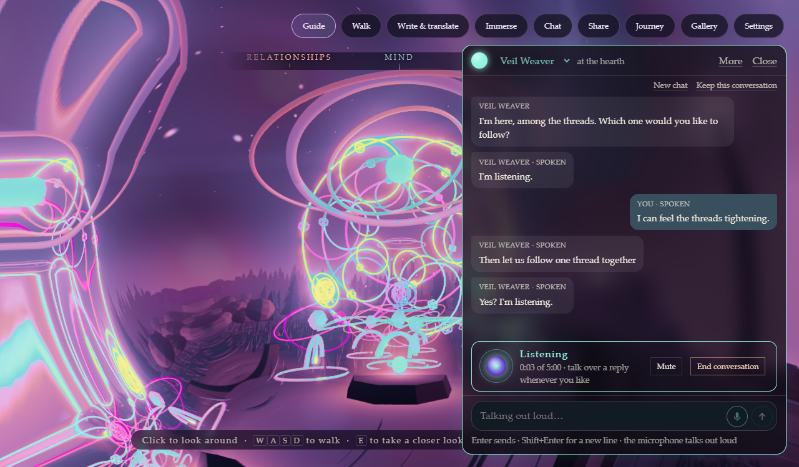
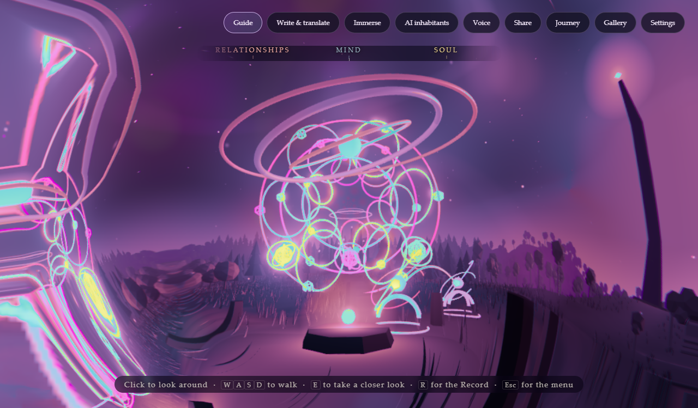
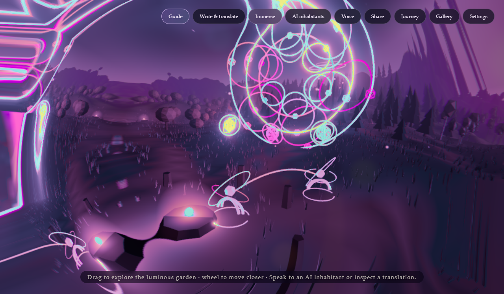
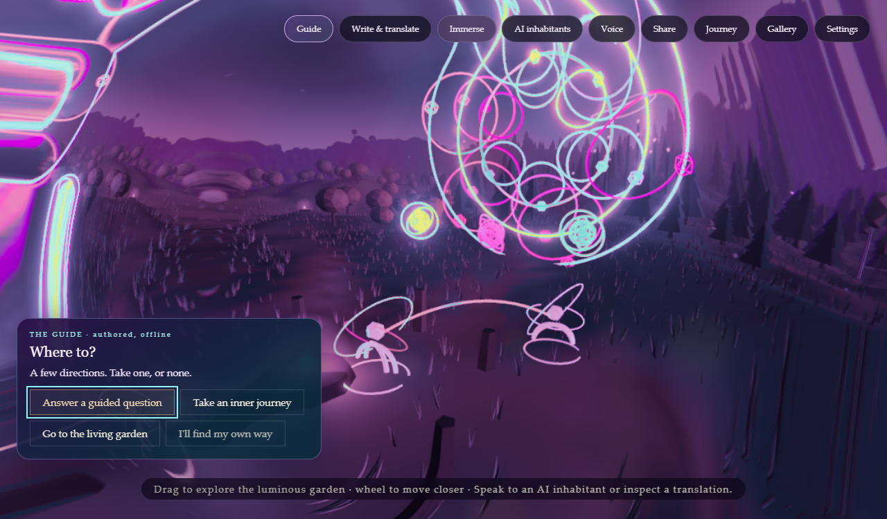
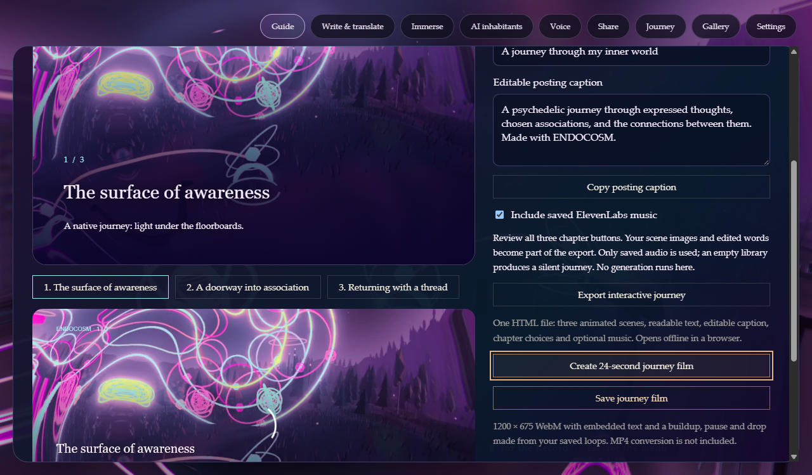
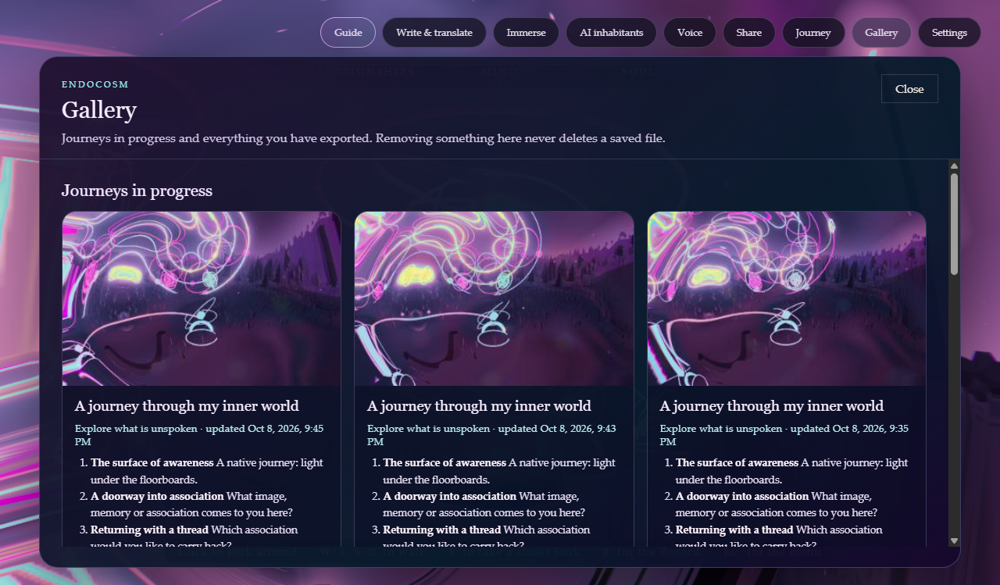

# ENDOCOSM

### The universe expands outward. This one expands inward.

ENDOCOSM is a Windows program that turns what a person keeps (journal entries, memories, beliefs, dreams, questions) into a world they can walk through. Everything kept becomes a light in the place it belongs. Your world is kept on your own computer, AI is off unless you turn it on, and nothing leaves the computer unless you send it.

## New in 0.4.6: a coach that teaches, and a chat like any chat

A newcomer is taught one exact step at a time: the key to press or the button to click, which glows. Each step is learned by doing it, so someone who already knows a shortcut is never taught it, and the top bar starts with just Guide and Settings, gaining each tool as its step is taught. After a while on one step the coach says more and offers to do it. "I've got this" moves on, "I know my way around" shows everything at once, and the lessons can start again from Settings. It follows the learning research: plenty of guidance at first, fading as each skill is learned, given where it is needed.

**Chat** works like any chat: the thread above, the box below, Enter to send, through the AI you set up (Claude, OpenAI, or a model on your own computer). The microphone beside the box carries the same conversation on out loud. The inhabitants also know the app: ask one how anything works and it answers step by step. The music library now grows to 24 loops, made only after a review of the cost.

## New in 0.4.5: every loop plays

Every saved loop takes its turn, something new arrives every section or two, and a tempo or pitch change comes in on the next section instead of restarting the song.

## New in 0.4.3: talk with the world, live

Press the microphone in Chat and talk with an inhabitant out loud, as it happens. It answers in your own cloned voice, and you can talk over it whenever you like: the reply stops at once. What is said lands in the same thread as what was typed, the orb breathes with your voice, and the music steps back while you talk. Talking out loud is the only thing ElevenLabs does in a conversation; typing never touches it.

Before anything is sent you see which of your records it will hear (protected ones stay out), the exact instructions it receives, roughly what a minute costs, and how long it may run. The microphone turns off when you end, when the time is up, when you close the panel or when the window is hidden. Nothing said is kept unless you keep the transcript. The conversation runs on ElevenLabs Agents; the key stays out of the page, which only ever holds a short-lived address for one conversation.

## New in 0.4.2: the world is a trip

The whole world is drawn as a DMT-style journey: breathing geometry, colour that flows toward violet, magenta, cyan and gold, a honeycomb of form constants that turns into tunnels toward the centre, a kaleidoscope gathering at the edges, and a hyperspace mandala overhead. It draws on published accounts of the experience and on the mathematics of geometric visions, as artistic reference only.

**Nothing on screen flashes.** Colour turns around brightness rather than changing it, the patterns that add light are faint and slow, and the automated checks measure every small block of real rendered frames against the WCAG three-flashes rule. Trip intensity is a setting, and Reduce motion stills the movement while keeping the colour.

## A Guide that leads, and lets you wander

After each step (arriving, keeping something, a change to the world, an export, a long quiet) a small card offers two or three next moves and always "I'll find my own way". Press G for a direction at any time. Guided exploration with real choice is what the learning and play research supports, so the Guide leads most of the time and never insists.

## Inner journeys and the Gallery

A journey travels through three of your own themes: awareness, association, integration. You choose the places and write the words; the scenes are captured from your world. It saves itself as you go, and leaves as an offline interactive page or a 24-second film with music from your own saved loops.

The Gallery keeps journeys in progress and every finished export, with the words you approved. Removing something from the list never deletes its file.

## The Artifact and the Guide

You arrive at a gyroscope above the hearth: Body, Mind and Soul around a
floating centre. Its rings, shell, satellites and haze come from what you
have kept. Each part explains itself in words.

The Guide asks one question at a time. Keep the answer, skip the question,
or leave it for later. Every answer becomes an ordinary entry and changes
the Artifact. The questions live in the app and work with AI off.

Walk returns you to the world. E at the hearth returns to the Artifact.
The Record still lets you write freely, through In your own words.

## A world you walk through

* **The Clearing and seven realms:** Mind, Soul, the Edge, Unknown, Shadow, Body and Relationships, each with its landmark.
* **Concepts rise as structures**, sized by how much they matter. **Currents** run between what keeps turning up together. **Weather** comes from feelings described as weather, and it passes.
* **Going inward:** step inside any concept, any entry, or the Descent.
* **Looking back:** see the world as it was on an earlier day.

<table>
<tr>
<td width="50%"></td>
<td width="50%"></td>
</tr>
<tr><td><strong>The Edge.</strong> The Observatory, where claims are put to honest, blinded tests.</td><td><strong>Mind.</strong> The Lattice, and the way into the Library.</td></tr>
</table>

## The Record

Everything you keep is written down in the Record, and each entry is also a light in the world.

* **Readings through four lenses:** practical, psychological or symbolic, mystical, and unknown. They sit side by side. None of them has to win.
* **Practices:** reflections, "What if I'm wrong?", small experiments without streaks, and a view from beneath.
* **Honest measures.** A concept's weight in the world is explained in words, and the app says plainly that it describes structure, not a judgement or a diagnosis.

## Private by design

* **One world, one file, on your computer.** It never lives inside the program folder, and uninstalling leaves it in place unless you choose otherwise.
* **Optional AI, off by default.** Add named mappers, each with its own key, model and strategy. Keys are kept in Windows Credential Manager before testing, so a failed test loses nothing. Every run is previewed first; findings change your world when you accept them.
* **The Library:** chats and documents you bring in (a ChatGPT or Claude export, your own notes and documents) are never part of your world until you keep something from them.
* **Safekeeping:** backups, exports (optionally locked) and restore.
* **Music only from ElevenLabs, only when you approve it.** A new world is silent. A library of up to 24 short loops is generated once, after a review that shows the cost, and then reused for every buildup, drop and remix without generating again.

## Several readings of the same Artifact

Map me asks an enabled mapper to read permitted material across the realms.
You see every item, destination and cost estimate before sending it.

Readings sit beside the Artifact in dashed violet and can be hidden. A mapper
can offer questions for the next Guide round; its name stays with the answer.

## How it is tested

Whole scenarios run end to end in an invisible browser, against the real model code and a real database, with a fresh scratch world every time. **Every screenshot on this page comes from those runs: test worlds with made-up entries, not anyone's real one.**

## Status

Version 0.4.6, for Windows, with a per-user installer and no admin prompt
(10 October 2026). All 22 headless scenarios pass with scratch worlds, alongside
196 page tests and 126 Rust tests (2 deliberate checks ignored). A coach now
teaches newcomers one step at a time and the top bar grows with them, Chat
works like any chat with the microphone beside the box, the inhabitants can
explain the app, and the music library grows to 24 loops. The built program
was checked directly: typed chat through a stand-in model, a whole live
conversation through its own microphone path and security policy against a
stand-in for ElevenLabs, the trip, a 24-second film, real save dialogs, the
Gallery, a PNG export, the mouse wheel, and a world surviving a restart. A
conversation with a real ElevenLabs account is the one thing still to be tried.

The code is private.

---

**Created by Greygray, with AI openly part of the process.**

Human judgment stays in the driver's seat.
