# ENDOCOSM

### The universe expands outward. This one expands inward.

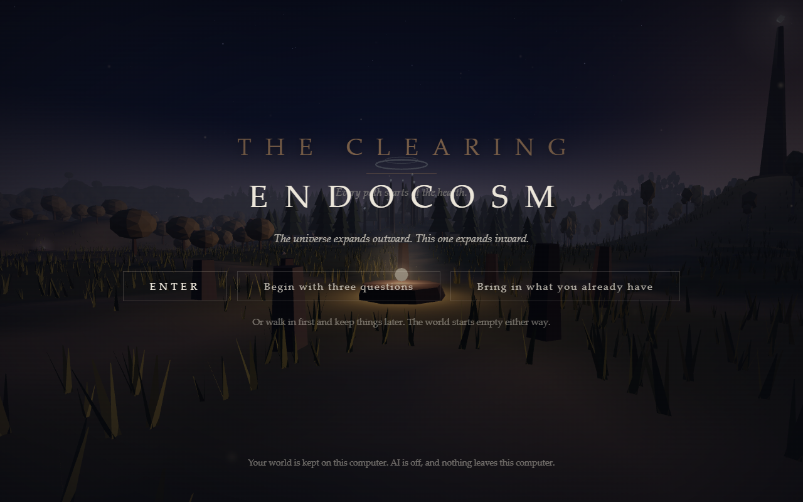

ENDOCOSM is a Windows program that turns what a person keeps (journal entries, memories, beliefs, dreams, questions) into a world they can walk through. Everything kept becomes a light in the place it belongs. Your world is kept on your own computer, AI is off unless you turn it on, and nothing leaves the computer unless you send it.

## The Artifact and the Guide

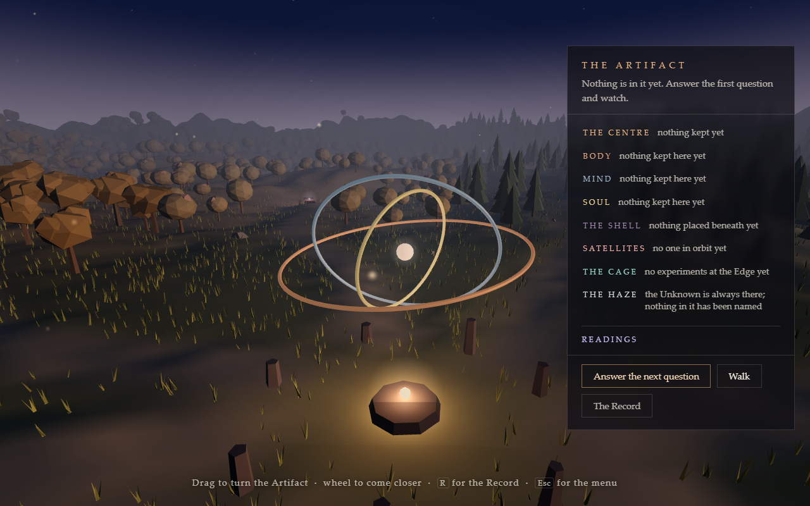

You arrive at a gyroscope above the hearth: Body, Mind and Soul around a
floating centre. Its rings, shell, satellites and haze come from what you
have kept. Each part explains itself in words.

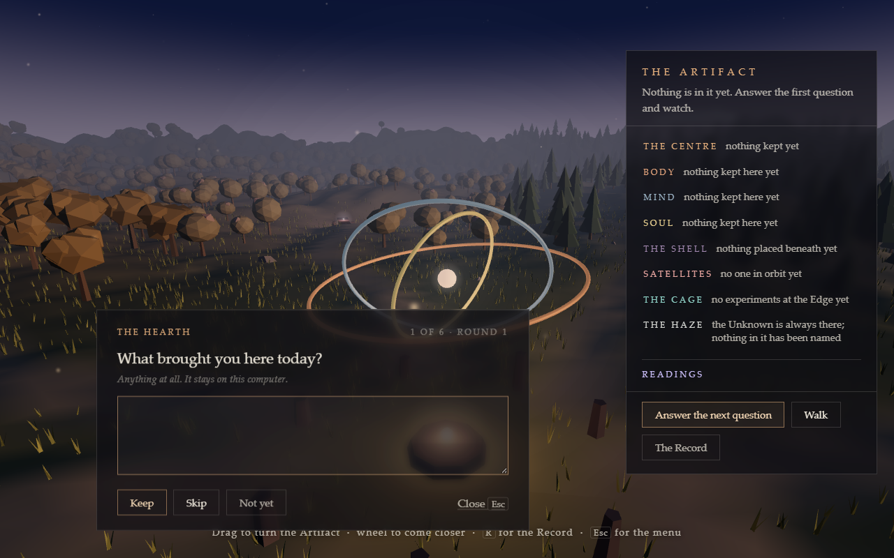

The Guide asks one question at a time. Keep the answer, skip the question,
or leave it for later. Every answer becomes an ordinary entry and changes
the Artifact. The questions live in the app and work with AI off.

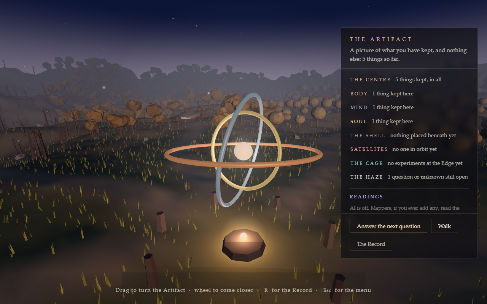

Walk returns you to the world. E at the hearth returns to the Artifact.
The Record still lets you write freely, through In your own words.

## A world you walk through

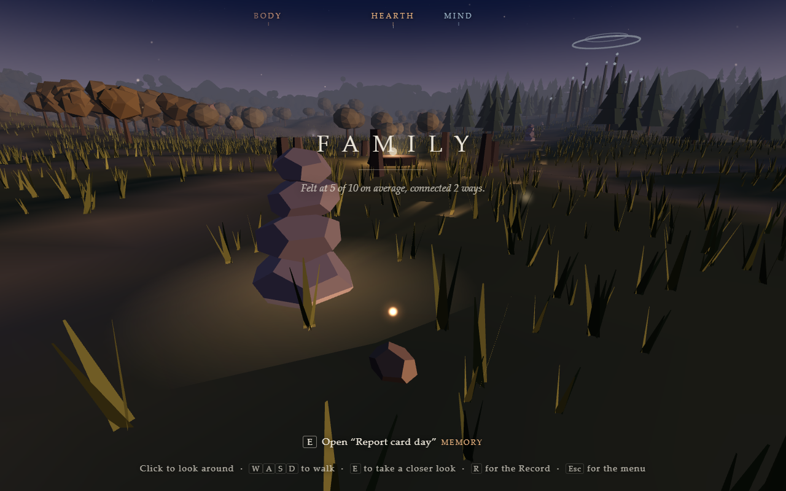

* **The Clearing and seven realms:** Mind, Soul, the Edge, Unknown, Shadow, Body and Relationships, each with its landmark.
* **Concepts rise as structures**, sized by how much they matter. **Currents** run between what keeps turning up together. **Weather** comes from feelings described as weather, and it passes.
* **Going inward:** step inside any concept, any entry, or the Descent.
* **Looking back:** see the world as it was on an earlier day.

<table>
<tr>
<td width="50%">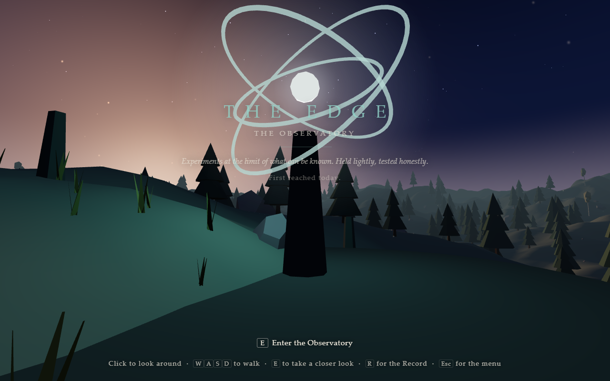</td>
<td width="50%">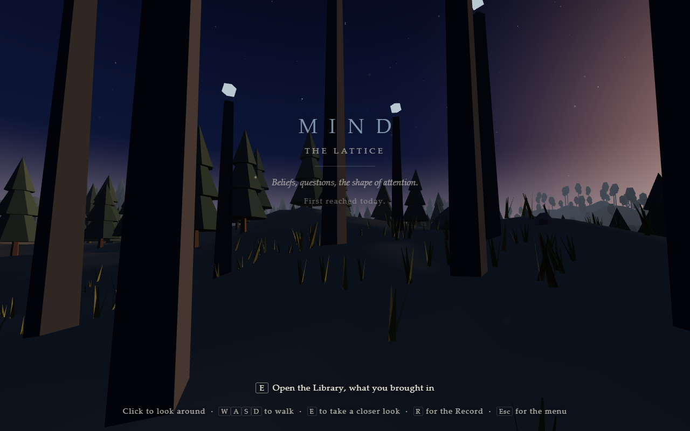</td>
</tr>
<tr><td><strong>The Edge.</strong> The Observatory, where claims are put to honest, blinded tests.</td><td><strong>Mind.</strong> The Lattice, and the way into the Library.</td></tr>
</table>

## The Record

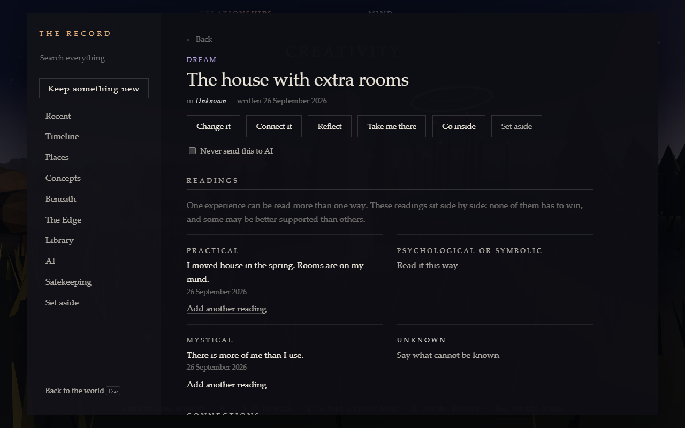

Everything you keep is written down in the Record, and each entry is also a light in the world.

* **Readings through four lenses:** practical, psychological or symbolic, mystical, and unknown. They sit side by side. None of them has to win.
* **Practices:** reflections, "What if I'm wrong?", small experiments without streaks, and a view from beneath.
* **Honest measures.** A concept's weight in the world is explained in words, and the app says plainly that it describes structure, not a judgement or a diagnosis.

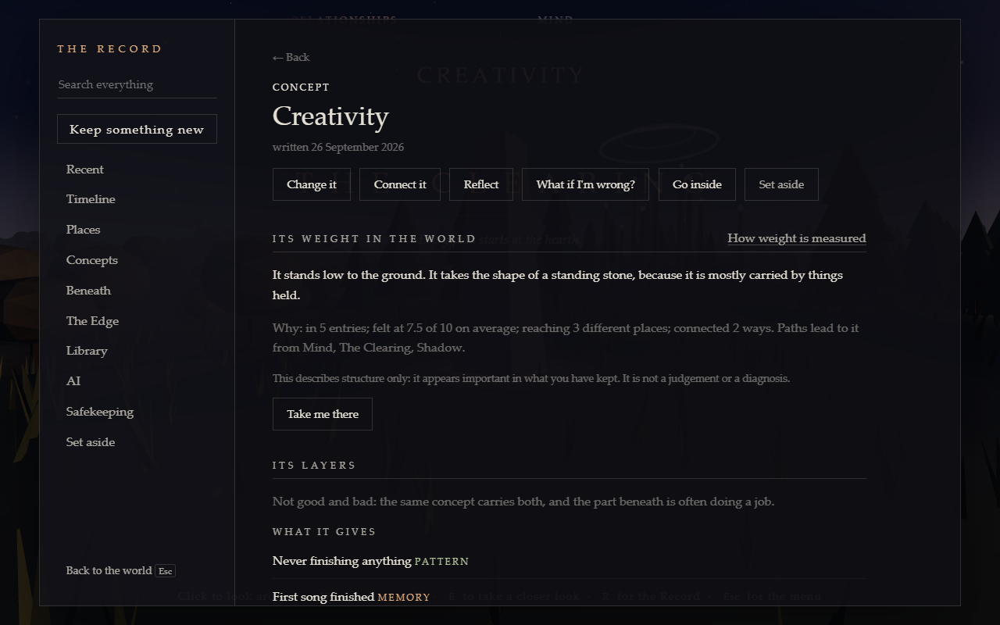

## Private by design

* **One world, one file, on your computer.** It never lives inside the program folder, and uninstalling leaves it in place unless you choose otherwise.
* **Optional AI, off by default.** Add named mappers, each with its own key, model and strategy. Keys are kept in Windows Credential Manager before testing, so a failed test loses nothing. Every run is previewed first; findings change your world when you accept them.
* **The Library:** chats and documents you bring in (a ChatGPT or Claude export, your own notes and documents) are never part of your world until you keep something from them.
* **Safekeeping:** backups, exports (optionally locked) and restore.

## Several readings of the same Artifact

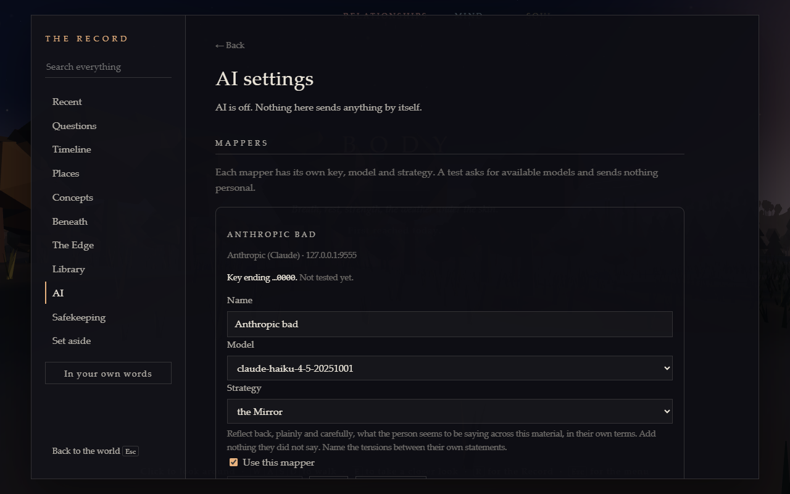

Map me asks an enabled mapper to read permitted material across the realms.
You see every item, destination and cost estimate before sending it.

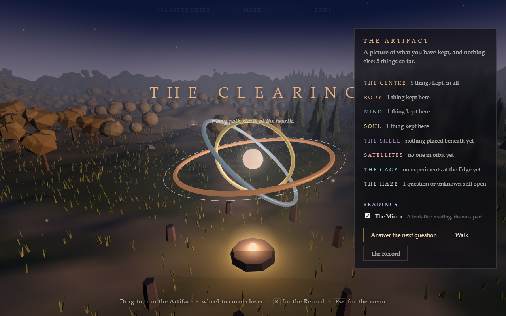

Readings sit beside the Artifact in dashed violet and can be hidden. A mapper
can offer questions for the next Guide round; its name stays with the answer.

## How it is tested

Whole scenarios run end to end in an invisible browser, against the real model code and a real database, with a fresh scratch world every time. **Every screenshot on this page comes from those runs: test worlds with made-up entries, not anyone's real one.**

## Status

Version 0.3.0, for Windows, with a per-user installer and no admin prompt.
The Guide, Artifact and mapper flows pass all ten headless scenarios with
scratch worlds, alongside 99 page tests and 95 Rust tests (2 deliberate checks
ignored). The installed 0.3.0 program passes its visible first-launch and reopen
checks, verified 7 October 2026. Each closes its scratch world as one complete
file; the checks leave real credentials untouched.

The code is private.

---

**Built by Greygray with AI collaboration openly included in the process.**

Human judgment stays in the driver's seat.
